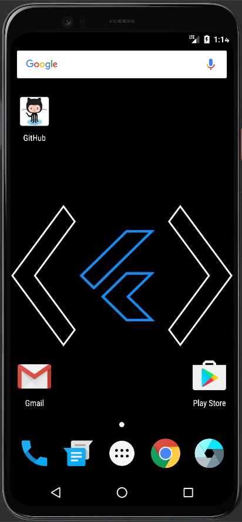
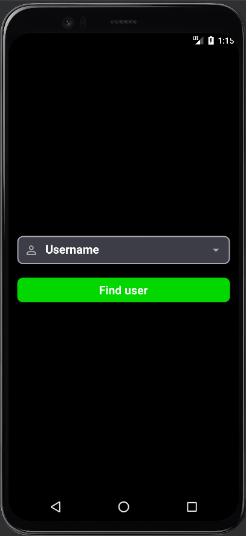
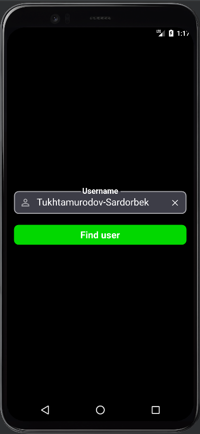
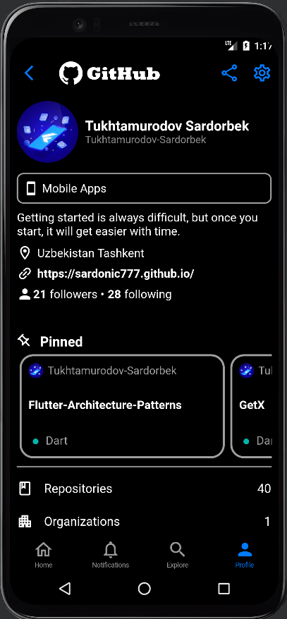

# GitHub Profile Page

# ```Used```
- Provider
- Web Scrapping (To get the list of pinned repositories)
- Github API
- Extension (To convert String to Hex Color)


| Use Case |
|----------------|
|  |


| Home Screen | Search Page |
|----------------|:----------------:|
|  |   |

| Search Page | Profile Page |
|:----------------:|:----------------:|
|  |  |
